# Project2
## Goal
Assess music genre trends over the past century and predict which genre of music will be the most listened to in the upcoming year. 
## Software and Platform
### Types of Software Used: 
- Programming Language: Python
- Data Processing & Analysis:
  - Pandas - Reading, cleaning, filtering, and merging the dataset
  - Facebook Prophet - Time series forecasting of genre popularity
- Data Visualization: Matplotlib & Seaborn
Creating bar charts, line graphs, and other custom visualization aesthetics
- Data Storage & Export: CSV Files
- Cloud Computing: Google Colab
### Packages Installed: 
  - pandas
  - numpy
  - matplotlib
  - seaborn
  - prophet 
### Platforms Used: 
Windows & Mac

## Map of Documentation

```mermaid
graph TB
  A[Project2]
  A1[README.md]
  A2[LICENSE.md]
  B[SCRIPTS]
  B1[EDA.ipynb]
  B2[cleaning merged data.ipynb]
  B3[genre predictive analysis.ipynb]
  B4[genre trend analysis.ipynb]
  B5[merging tracks and albums.ipynb]
  C[DATA]
  C1[cleaned_merged_tracks.csv]
  C2[raw_albums.csv]
  C4[obtaining tacks data.md]
  C3[Data Appendix]
  D[OUTPUT]

  A --> A1
  A --> A2
  A --> B
  B --> B1
  B --> B2
  B --> B3
  B --> B4
  B --> B5
  A --> C
  C --> C1
  C --> C2
  C --> C3
  C --> C4
  A --> D

  %% Styling for main project folder (Dark Blue)
  style A fill:#003366,stroke:#001f3f,stroke-width:2px,color:white;

  %% Styling for main categories (Light Blue)
  style A1 fill:#4a90e2,stroke:#003d5b,stroke-width:2px,color:white;
  style A2 fill:#4a90e2,stroke:#003d5b,stroke-width:2px,color:white;
  style B fill:#4a90e2,stroke:#003d5b,stroke-width:2px,color:white;
  style C fill:#4a90e2,stroke:#003d5b,stroke-width:2px,color:white;
  style D fill:#4a90e2,stroke:#003d5b,stroke-width:2px,color:white;

  %% Styling for subsets (Light Red)
  style B1 fill:#ff9999,stroke:#8b0000,stroke-width:1px,color:black;
  style B2 fill:#ff9999,stroke:#8b0000,stroke-width:1px,color:black;
  style B3 fill:#ff9999,stroke:#8b0000,stroke-width:1px,color:black;
  style B4 fill:#ff9999,stroke:#8b0000,stroke-width:1px,color:black;
  style B5 fill:#ff9999,stroke:#8b0000,stroke-width:1px,color:black;
  style C1 fill:#ff9999,stroke:#8b0000,stroke-width:1px,color:black;
  style C2 fill:#ff9999,stroke:#8b0000,stroke-width:1px,color:black;
  style C3 fill:#ff9999,stroke:#8b0000,stroke-width:1px,color:black;
  style C4 fill:#ff9999,stroke:#8b0000,stroke-width:1px,color:black;
```

## Reproduction Instructions

1. **Set up Environment**
    - install python
    - install required libraries (listed above)
  
2. **Download Dataset**
    - navigate to **DATA** folder
    - download `raw_albums.csv`
    - follow instructions in **obtaining tracks data.md** to download `tracks.csv`

3. **Clean Data and EDA**
   - navigate to **SCRIPTS** folder
   - open `merging tracks and albums.ipynb`
   - run each cell to:
       - load in `raw_albums.csv` and `tracks.csv`
       - clean dataset
       - merge and download the datasets into one called `merged_tracks_and_albums.csv`
    - navigate to **SCRIPTS**
    - open `cleaning merged data.ipynb`
    - run each cell to:
       - load in `merged_tracks_and_albums.csv`
       - clean dataset
       - download cleaned version- `cleaned_merged_tracks.csv`
     - naviagate to **SCRIPTS**
     - open `EDA.ipynb`
     - run each cell to:
         - perform EDA
         - visualize genre trends
           
4. **Analyze Genre Trends**
   - navigate to **SCRIPTS**
   - open `genre trend analysis.ipynb`
   - run each cell to:
       - perform time series decomposition
       - generate visualizations of genre trends
         
5. **Genre Predictions**
